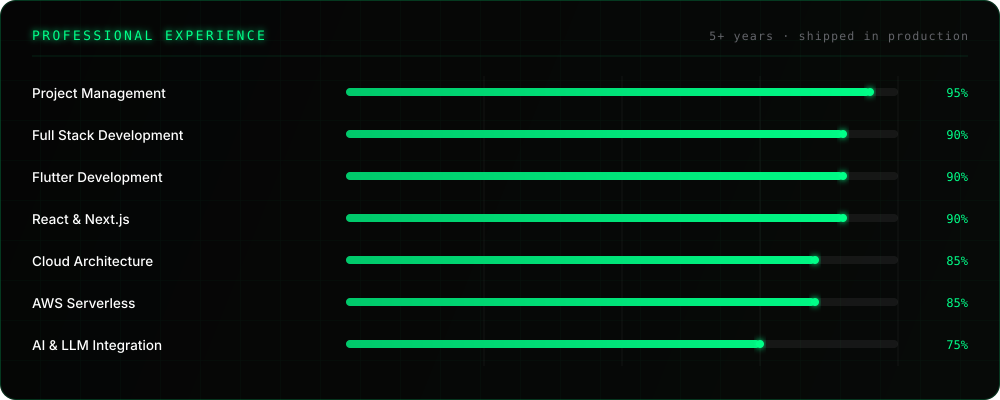
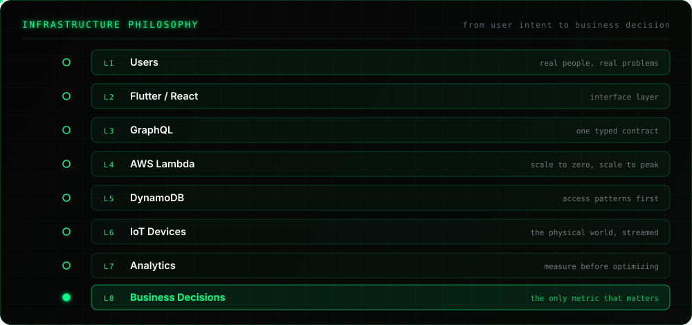

  

  

  
  &nbsp;
  
  &nbsp;
  <!-- TODO: replace with your real LinkedIn slug -->
  
  &nbsp;
  

 

## `01` &nbsp;Core Stack

| ◇ Frontend | ◈ Backend | ▲ Cloud | ▣ Mobile |
|:-----------|:----------|:--------|:---------|
| React · Next.js | Node.js · Python | AWS Lambda | Flutter |
| TypeScript | GraphQL · REST | DynamoDB · S3 | React Native |
| TailwindCSS | Event-driven | Cognito · IoT Core | iOS · Android |

  

 

## `02` &nbsp;Architecture

  

 

## `03` &nbsp;What I Build

<table>
<tr>
<td width="33%" align="center" valign="top">

### ▰ &nbsp;Fleet & IoT

`REAL-TIME`

Live GPS tracking

Driver identification

Telemetry pipelines

</td>
<td width="33%" align="center" valign="top">

### ▲ &nbsp;Cloud Platforms

`SERVERLESS`

AWS serverless backends

GraphQL APIs

Infrastructure as code

</td>
<td width="33%" align="center" valign="top">

### ◉ &nbsp;AI Automation

`INTELLIGENT`

LLM agents

Workflow automation

Productivity tooling

</td>
</tr>
</table>

 

## `04` &nbsp;Featured Projects

<table>
<tr>
<td width="50%" valign="top">

**SuperFleet** — enterprise fleet management platform.

`Live GPS` `Driver ID` `Analytics` `Mobile app`

   

</td>
<td width="50%" valign="top">

**Mandator GED** — enterprise document management.

`E-signature` `Workflow` `Versioning` `RBAC`

   

</td>
</tr>
<tr>
<td width="50%" valign="top">

**AI & Automation** — building intelligent assistants and business automation tools.

`AI Assistants` `Workflow Automation` `OpenAI` `AWS Bedrock`

</td>
<td width="50%" valign="top">

 

> ### `Current mission`
>
> **Building scalable software products that solve real business problems.**

 

`◇` Fast · `◈` Secure · `▲` Cloud-native
`▰` Scalable · `◉` Maintainable

</td>
</tr>
</table>

 

## `05` &nbsp;Experience

  

 

## `06` &nbsp;Development Workflow

`💡 Idea` **→** `📐 Architecture` **→** `💻 Development` **→** `🧪 Testing`

**↓**

`🔄 Continuous Improvement` **←** `📊 Monitoring` **←** `🚀 Deployment` **←** `⚙️ CI/CD`

 

## `07` &nbsp;Product Mindset

<table>
<tr>
<td width="50%" valign="top">

**What drives me**

Turning complex business challenges into scalable digital products. I ship the whole product — not just the code that runs it.

`Design for production` · `Measure before optimizing` · `Automate everything repeatable`

</td>
<td width="50%" valign="top">

**Personal mission**

Design software that scales, automate what can be automated, and always build with the end user in mind.

`Security by design` · `Deliver value continuously` · `Own the outcome`

</td>
</tr>
</table>

 

## `08` &nbsp;Infrastructure Philosophy

  

 

## `09` &nbsp;Engineering Metrics

 

## `10` &nbsp;Currently

<table>
<tr>
<td width="50%" valign="top">

**Exploring**

`☸️ Kubernetes` `🏗️ Terraform` `🤖 AI Agents`
`⚡ Event-Driven Architecture` `📊 Data Engineering`
`🔐 Cloud Security` `🚀 Platform Engineering`

</td>
<td width="50%" valign="top">

**Learning path**

| Roadmap | Status |
|:--------|:------:|
| AWS Solutions Architect | 🎯 In progress |
| Terraform Associate | 🔜 Planned |
| Kubernetes (CKA) | 🔜 Planned |

</td>
</tr>
</table>

 

## `11` &nbsp;Open Source

Progressively giving back by building reusable tools and sharing practical solutions.

`📦 Flutter packages` &nbsp;·&nbsp; `⚛️ React components` &nbsp;·&nbsp; `▲ AWS templates` &nbsp;·&nbsp; `🤖 AI utilities` &nbsp;·&nbsp; `⚙️ Automation scripts`

 

## `12` &nbsp;Deep Dive

  

  

 

## `13` &nbsp;Contact

  
  &nbsp;
  <!-- TODO: replace with your real LinkedIn slug -->
  
  &nbsp;
  <!-- swap for mailto:your@email if you want your address public -->
  
  &nbsp;
  

  

